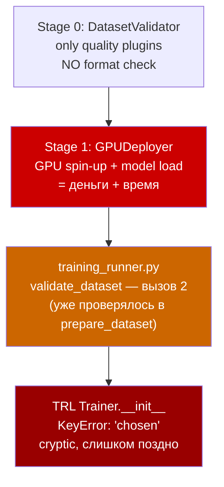
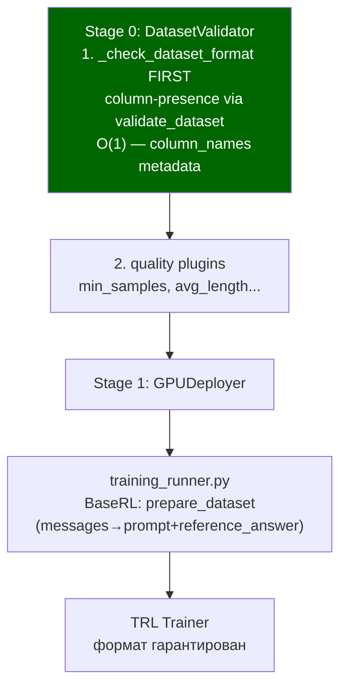

# Format Check в Stage 0 DatasetValidator

## Контекст: что делает сообщество

- **`skip_prepare_dataset=True`** — встроенная фича TRL, десятки туториалов используют её. Сигнал: данные готовятся до пайплайна, не внутри.
- **Формат DPO**: TRL официально принимает `chosen`/`rejected` напрямую. Никаких `isinstance` проверок в примерах сообщества нет — TRL сам роняет с понятной ошибкой при неверном типе.
- **GRPOTrainer**: официально требует `prompt` колонку. `messages` — это формат значения `prompt`, не замена колонки. Поэтому конвертация `messages → prompt` в BaseRL — реальная работа, не over-engineering.

## Текущий поток (проблема)



## Целевой поток



---

## Изменения

### 1. [`src/pipeline/stages/dataset_validator.py`](src/pipeline/stages/dataset_validator.py)

**`_get_datasets_to_validate()`** — расширить возврат: добавить strategy phases для каждого датасета

```python
# БЫЛО: dict[str, DatasetConfig]
# СТАНЕТ: dict[str, tuple[DatasetConfig, list[StrategyPhaseConfig]]]
def _get_datasets_to_validate(self) -> dict[str, tuple[Any, list[Any]]]:
    datasets: dict[str, tuple[Any, list[Any]]] = {}
    for strategy in self._config.training.strategies:
        dataset_name = strategy.dataset
        dataset_config = self._config.get_dataset_for_strategy(strategy)
        if dataset_name not in datasets:
            datasets[dataset_name] = (dataset_config, [])
        datasets[dataset_name][1].append(strategy)
    return datasets
```

**`execute()`** — распаковать новый формат, передать `strategy_phases` в futures.

**`_validate_single_dataset()`** — добавить параметр `strategy_phases`, вызвать format check ПЕРВЫМ для train и eval:

```python
def _validate_single_dataset(self, dataset_name, dataset_config, strategy_phases, context):
    dataset = self._load_dataset_for_validation(...)

    # 1. FORMAT CHECK FIRST — train
    fmt = self._check_dataset_format(dataset, dataset_name, strategy_phases)
    if fmt.is_failure():
        return fmt  # fail fast, quality plugins не запускаются

    # 2. FORMAT CHECK — eval (если есть)
    eval_dataset, eval_ref = self._try_load_eval_dataset_for_validation(...)
    if eval_dataset is not None:
        fmt_eval = self._check_dataset_format(eval_dataset, dataset_name, strategy_phases)
        if fmt_eval.is_failure():
            return fmt_eval

    # 3. quality plugins (без изменений)
    ...
```

**Новый `_check_dataset_format()`** — вызывает `strategy.validate_dataset()` для каждого уникального типа:

```python
def _check_dataset_format(self, dataset, dataset_name, strategy_phases) -> Result[None, AppError]:
    from src.training.strategies.factory import StrategyFactory
    factory = StrategyFactory()
    seen_types: set[str] = set()
    for phase in strategy_phases:
        strategy_type = phase.strategy_type
        if strategy_type in seen_types:
            continue
        seen_types.add(strategy_type)
        strategy = factory.create(strategy_type, self._config)
        result = strategy.validate_dataset(dataset)
        if result.is_failure():
            err = result.unwrap_err()
            return Err(DatasetError(
                message=f"[{dataset_name}] Format check failed for '{strategy_type}': {err.message}",
                code="DATASET_FORMAT_ERROR",
            ))
    return Ok(None)
```

**Helper `_get_column_names(dataset)`** — безопасное получение колонок для `IterableDataset` (edge case `column_names=None`):

```python
@staticmethod
def _get_column_names(dataset: Dataset | IterableDataset) -> list[str]:
    if dataset.column_names is not None:
        return dataset.column_names
    sample = next(iter(dataset.take(1)), None)  # peek 1 sample
    return list(sample.keys()) if sample else []
```

---

### 2. [`src/training/strategies/base.py`](src/training/strategies/base.py) — чистка контракта

**`prepare_dataset`** — убрать из `@abstractmethod`, дать дефолт no-op (BaseRL переопределит):

```python
# БЫЛО: @abstractmethod
# СТАНЕТ:
def prepare_dataset(self, dataset: Dataset, tokenizer: PreTrainedTokenizer) -> Result[Dataset, StrategyError]:
    return Ok(dataset)
```

**Удалить полностью:**
- `get_recommended_hyperparameters` — дубль `DEFAULT_LEARNING_RATES` в `src/constants.py`

**Убрать из `@abstractmethod`** (дать дефолт):
- `get_training_objective` → дефолт `return self.get_trainer_type()`
- `get_metadata` → дефолт строится из `get_trainer_type()`

**Остаются `@abstractmethod`**: `validate_dataset`, `get_trainer_type`, `get_trainer_class`, `get_config_class`.

---

### 3. Supervised стратегии — убрать prepare_dataset

**Удалить `prepare_dataset`** из: `sft.py`, `dpo.py`, `orpo.py`, `cpt.py`, `cot.py`.

Базовый дефолт `return Ok(dataset)` покрывает все эти случаи. Никакой трансформации не происходило — только validate call внутри, который убирается.

**`validate_dataset` в DPO и ORPO** — убрать deep isinstance-проверки:

```python
# УДАЛИТЬ из dpo.py и orpo.py (код сам признаёт их необязательность):
# except Exception: logger.warning(...); # Continue anyway, TRL will catch format errors
sample = dataset[0]
chosen = sample["chosen"]
if not isinstance(chosen, list) or not isinstance(rejected, list): ...
if not isinstance(chosen[0], dict): ...
if "role" not in chosen[0] or "content" not in chosen[0]: ...

# ОСТАВИТЬ только:
if "chosen" not in columns or "rejected" not in columns:
    return Err(...)
```

**CoT `validate_dataset`** — если YAGNI legacy format: оставить только `messages` check. Если нужно поддерживать `instruction/reasoning/answer` — оставить как есть, но убрать `prepare_dataset`.

Файлы: [`src/training/strategies/sft.py`](src/training/strategies/sft.py), [`src/training/strategies/dpo.py`](src/training/strategies/dpo.py), [`src/training/strategies/orpo.py`](src/training/strategies/orpo.py), [`src/training/strategies/cpt.py`](src/training/strategies/cpt.py), [`src/training/strategies/cot.py`](src/training/strategies/cot.py)

---

### 4. BaseRL — `prepare_dataset` остаётся

**Причина**: GRPOTrainer официально требует колонку `prompt`. Если датасет содержит `messages`, без конвертации тренировка не запустится. Это реальная трансформация, которую TRL не делает сам.

`_extract_prompt_payload` применяет `tokenizer.apply_chat_template` — именно тот формат, который ожидает GRPOTrainer.

Файл [`src/training/strategies/base_rl.py`](src/training/strategies/base_rl.py) — **не трогать**.

---

### 5. [`src/training/orchestrator/phase_executor/training_runner.py`](src/training/orchestrator/phase_executor/training_runner.py)

**Убрать** вызов `strategy.validate_dataset()` — Stage 0 гарантирует формат:

```python
# УДАЛИТЬ:
validation_result = strategy.validate_dataset(raw_train_dataset)
eval_validation = strategy.validate_dataset(raw_eval_dataset)
```

**Оставить** вызов `strategy.prepare_dataset()` — он нужен для BaseRL (`messages→prompt`). Для всех остальных стратегий вернёт `Ok(dataset)` из базового дефолта.

---

## Итоговая матрица

| Метод | Стратегия | До | После |
|---|---|---|---|
| `prepare_dataset` | SFT, DPO, ORPO, CPT, CoT | override (no-op) | **удалён** (базовый дефолт) |
| `prepare_dataset` | BaseRL | реальная логика | **не трогать** |
| `validate_dataset` deep checks | DPO, ORPO | isset+isinstance+keys | **только column check** |
| `validate_dataset` | Все остальные | column check | без изменений |
| `get_recommended_hyperparameters` | base + все стратегии | дубль constants | **удалён** |
| `get_training_objective` | base | @abstractmethod | non-abstract, дефолт |
| `get_metadata` | base | @abstractmethod | non-abstract, дефолт |

---

## Риски

- **Coupling pipeline → training**: `_check_dataset_format` импортирует `StrategyFactory`. Приемлемо — `_get_datasets_to_validate` уже читает `config.training.strategies`.
- **IterableDataset column_names = None**: edge case. Решается helper `_get_column_names(dataset)`.
- **CoT legacy format**: если где-то в проде используется `instruction/reasoning/answer` датасет — `validate_dataset` CoT нужно оставить в текущем виде (без `prepare_dataset`). Если нет — упростить до `messages` only.
- **Тесты**: unit-тесты, проверяющие `prepare_dataset` на ошибку формата — нужно обновить. Тест формата переезжает в `test_dataset_validator.py`.
