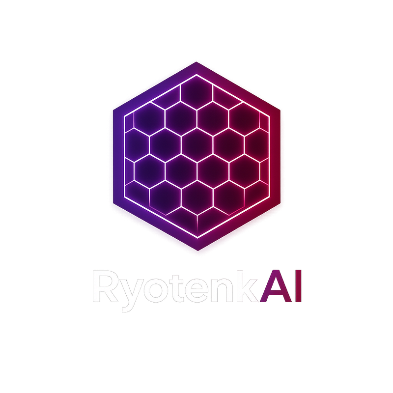
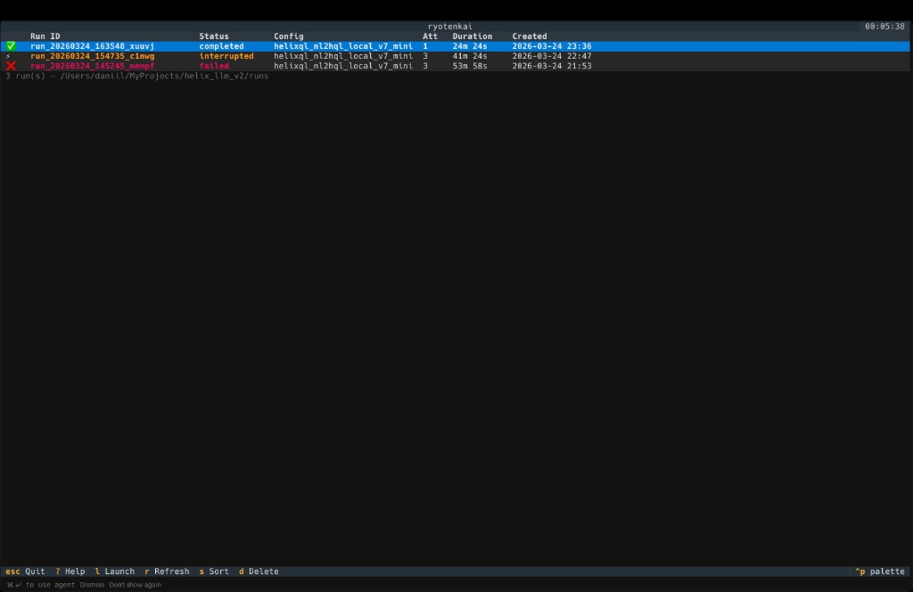
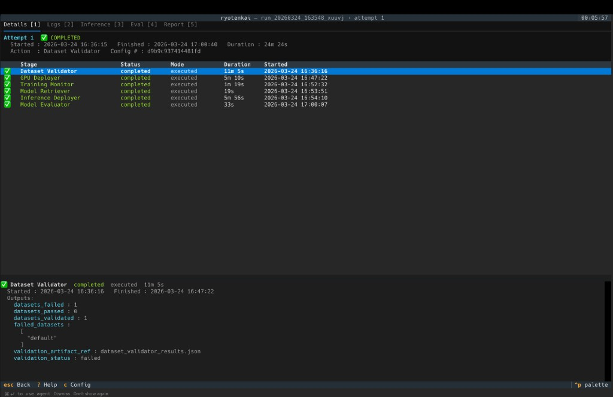
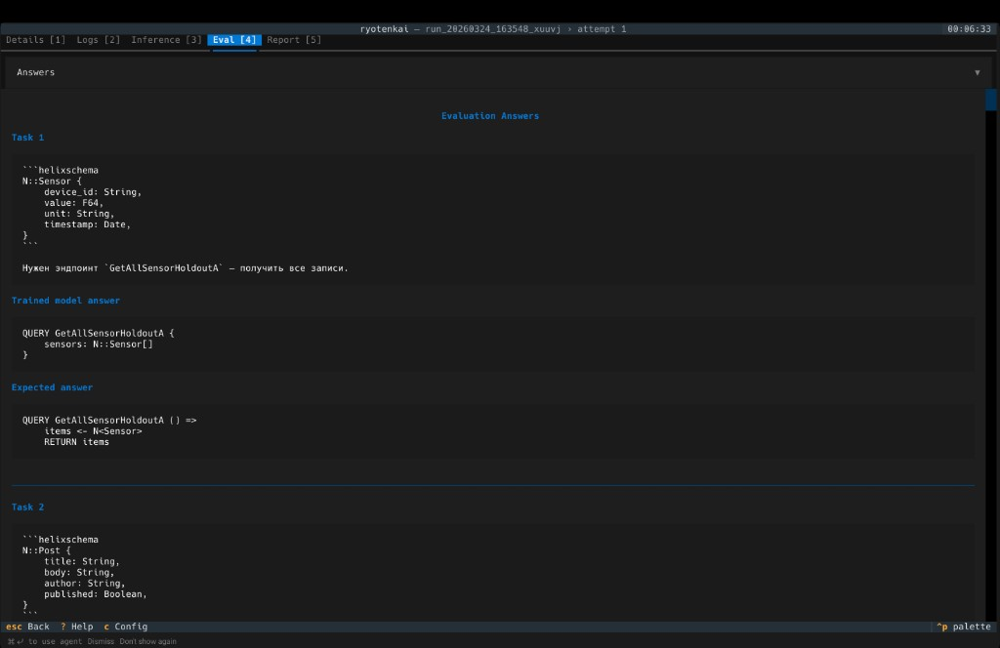

<p align="center">
  
</p>
<h1 align="center">RyotenkAI</h1>

<p align="center">
  宣言的な LLM fine-tuning。<br>
  YAML 設定とデータセットを渡すだけで、RyotenkAI が検証、GPU 準備、学習、推論デプロイ、評価、レポート生成までを一貫してオーケストレーションします。
</p>

<p align="center">
  <a href="../README.md">🇬🇧 English</a> |
  <a href="README.ru.md">🇷🇺 Русский</a> |
  🇯🇵 日本語 |
  <a href="README.zh-CN.md">🇨🇳 简体中文</a> |
  <a href="README.ko.md">🇰🇷 한국어</a> |
  <a href="README.es.md">🇪🇸 Español</a> |
  <a href="README.he.md">🇮🇱 עברית</a>
</p>

<p align="center">
  <a href="#クイックスタート">クイックスタート</a> ·
  <a href="#仕組み">仕組み</a> ·
  <a href="#学習戦略">戦略</a> ·
  <a href="#gpu-プロバイダー">プロバイダー</a> ·
  <a href="#プラグインシステム">プラグイン</a> ·
  <a href="#設定">設定</a>
</p>

<p align="center">
  <a href="https://discord.gg/QqDM2DbY">
    
  </a>
  <br>
  
  
  
  
  
  <br>
  
  
  
  
  
</p>

---

## RyotenkAI とは

RyotenkAI は、LLM fine-tuning のための宣言的 control plane です。ワークフローを YAML で記述し、データセットを指定すると、RyotenkAI がデータセット検証、GPU のプロビジョニング、多段階学習、モデル取得、推論デプロイ、評価、MLflow での実験レポート作成まで、ライフサイクル全体を実行します。

| 手動の fine-tuning ワークフロー | RyotenkAI |
|---|---|
| データセット品質を手作業で確認する | プラグインベースの検証: format、duplicates、length、diversity |
| GPU に SSH してスクリプトを実行する | 1 コマンドで GPU 準備、学習デプロイ、監視まで実行 |
| 正常終了することを祈って待つ | GPU メトリクス、loss curve、OOM 検知をリアルタイムで監視 |
| 重みを手動で回収する | adapters を自動取得し、LoRA を merge して HF Hub へ公開可能 |
| inference server を個別に立ち上げる | health check 付きの vLLM endpoint をデプロイ |
| 出力を手作業で評価する | syntax、semantic match、LLM-as-judge などのプラグイン評価 |
| ドキュメントに手で記録する | MLflow の実験追跡 + 生成される Markdown レポート |

---

## 仕組み

### パイプライン全体の流れ

```text
YAML Config
    │
    ▼
┌─────────────────┐
│ Dataset Validator│  学習前にデータ品質を検証
│ (plugin system)  │  min_samples, diversity, format, custom
└────────┬────────┘
         │
         ▼
┌─────────────────┐
│  GPU Deployer    │  計算資源を準備 (SSH または RunPod API)
│                  │  training container とコードを配置
└────────┬────────┘
         │
         ▼
┌─────────────────┐
│Training Monitor  │  プロセス監視、ログ解析、OOM 検知
│                  │  GPU metrics, loss curves, health checks
└────────┬────────┘
         │
         ▼
┌─────────────────┐
│ Model Retriever  │  adapters / merged weights を取得
│                  │  必要に応じて HuggingFace Hub に公開
└────────┬────────┘
         │
         ▼
┌─────────────────┐
│Inference Deployer│  Docker 上で vLLM server を起動
│                  │  Health checks, OpenAI-compatible API
└────────┬────────┘
         │
         ▼
┌─────────────────┐
│ Model Evaluator  │  live endpoint に対して評価プラグインを実行
│ (plugin system)  │  syntax, semantic match, LLM judge, custom
└────────┬────────┘
         │
         ▼
┌─────────────────┐
│Report Generator  │  MLflow から必要なデータを収集
│ (plugin system)  │  実験レポートを Markdown で生成
└─────────────────┘
```

### 学習の実行フロー

```text
Pipeline (control plane)              GPU Provider (single_node / RunPod)
         │                                         │
    SSH / API ──────────────────────────► Docker container
         │                                   │
    rsync code ─────────────────────────►  /workspace/
         │                                   │
    start training ─────────────────────►  accelerate launch train.py
         │                                   │
    monitor ◄───────────── logs, markers, GPU metrics
         │                                   │
    retrieve artifacts ◄────── adapters, checkpoints, merged weights
```

### 学習戦略チェーン (GPU container 内部)

自動状態管理、OOM リカバリ、checkpoint 管理を備えた多段階学習:

```text
run_training(config.yaml)
  │
  ├── MemoryManager.auto_configure()     GPU tier を検出し、VRAM 閾値を設定
  │     └── GPUPreset: margin, critical%, max_retries
  │
  ├── load_model_and_tokenizer()         ベースモデルをロード (まだ PEFT なし)
  │     └── MemoryManager: 前後の snapshot と CUDA cache cleanup
  │
  ├── DataBuffer.init_pipeline()         状態追跡を初期化
  │     └── pipeline_state.json          各 phase の状態と checkpoint path
  │     └── phase_0_sft/                 phase ごとの出力ディレクトリ
  │     └── phase_1_dpo/
  │
  └── ChainRunner.run(strategies)        phase chain を順次実行
        │
        │   各 phase について (例: CPT → SFT → DPO):
        │
        ▼
  ┌─────────────────────────────────────────────────────────┐
  │  PhaseExecutor.execute(phase_idx, phase, model, buffer) │
  │                                                         │
  │  1. buffer.mark_phase_started(idx)                      │
  │     └── pipeline_state.json へアトミックに状態保存      │
  │                                                         │
  │  2. StrategyFactory.create(phase.strategy_type)         │
  │     ├── SFTStrategy     (messages → instruction tuning) │
  │     ├── DPOStrategy     (chosen/rejected → alignment)   │
  │     ├── ORPOStrategy    (preference → odds ratio)       │
  │     ├── GRPOStrategy    (reward-guided RL)              │
  │     ├── SAPOStrategy    (self-aligned preference)       │
  │     └── CPTStrategy     (raw text → domain adaptation)  │
  │                                                         │
  │  3. dataset_loader.load_for_phase(phase)                │
  │     └── strategy.validate_dataset + prepare_dataset     │
  │                                                         │
  │  4. TrainerFactory.create_from_phase(...)               │
  │     ├── strategy.get_trainer_class() → TRL Trainer      │
  │     ├── hyperparams を global と phase override で統合  │
  │     ├── PEFT config を作成 (LoRA / QLoRA / AdaLoRA)     │
  │     ├── callbacks を接続 (MLflow, GPU metrics)          │
  │     └── MemoryManager.with_memory_protection で保護      │
  │                                                         │
  │  5. trainer.train()                                     │
  │     └── MemoryManager.with_memory_protection            │
  │           ├── VRAM 使用量を監視                         │
  │           ├── OOM 時は aggressive_cleanup + retry       │
  │           └── max_retries は GPU tier preset に従う     │
  │                                                         │
  │  6. checkpoint-final を保存                             │
  │     ├── buffer.mark_phase_completed(metrics)            │
  │     └── buffer.cleanup_old_checkpoints(keep_last=2)     │
  │                                                         │
  └─────────────────────┬───────────────────────────────────┘
                        │
                        ▼  モデルはメモリ上で次の phase に渡される
                        │
               ┌────────┴────────┐
               │  次の phase は?  │
               │  idx < total    │──── No ──► 学習済みモデルを返す
               └────────┬────────┘
                        │ Yes
                        ▼
                 (PhaseExecutor を繰り返す)
```

### DataBuffer - phase 間の状態管理

```text
DataBuffer
  │
  ├── Pipeline State (pipeline_state.json)
  │     {
  │       "status": "running",
  │       "phases": [
  │         { "strategy": "sft", "status": "completed", "checkpoint": "phase_0_sft/checkpoint-final" },
  │         { "strategy": "dpo", "status": "running",   "checkpoint": null }
  │       ]
  │     }
  │
  ├── Phase Directories
  │     output/
  │     ├── phase_0_sft/
  │     │   ├── checkpoint-500/     (中間 checkpoint、自動削除)
  │     │   ├── checkpoint-1000/    (中間 checkpoint、自動削除)
  │     │   └── checkpoint-final/   (保持され、次 phase の入力になる)
  │     └── phase_1_dpo/
  │         └── checkpoint-final/
  │
  ├── Resume Logic
  │     クラッシュ/再起動時:
  │       1. load_state() → 未完了の最初の phase を見つける
  │       2. get_model_path_for_phase(idx) → 直前の checkpoint-final
  │       3. ベースモデルに PEFT adapters をロード
  │       4. get_resume_checkpoint(idx) → 中断 phase の checkpoint (あれば)
  │       5. 停止位置から学習を再開
  │
  └── Cleanup
         cleanup_old_checkpoints(keep_last=2)
         checkpoint-final を残し、中間の checkpoint-N/ ディレクトリを削除
```

### MemoryManager - GPU OOM 保護

```text
MemoryManager.auto_configure()
  │
  ├── GPU を検出: name, VRAM, compute capability
  │     ├── RTX 4060  (8GB)  → consumer_low   tier
  │     ├── RTX 4090  (24GB) → consumer_high  tier
  │     ├── A100      (80GB) → datacenter     tier
  │     └── Unknown          → safe fallback
  │
  ├── tier ごとの GPUPreset:
  │     margin_mb:    予約しておく VRAM 余裕量 (512-4096 MB)
  │     critical_pct: OOM recovery を発動する閾値 (85-95%)
  │     warning_pct:  warning を出す閾値 (70-85%)
  │     max_retries:  自動再試行回数 (1-3)
  │
  └── with_memory_protection(operation):
         ┌─────────────────────────────┐
         │  Attempt 1                  │
         │  ├── VRAM の余裕を確認      │
         │  ├── operation を実行       │
         │  └── Success → return       │
         │                             │
         │  OOM detected?              │
         │  ├── aggressive_cleanup()   │
         │  │   ├── gc.collect()       │
         │  │   ├── torch.cuda.empty_cache()
         │  │   └── 勾配をクリア        │
         │  ├── OOM event を MLflow に記録
         │  └── 再試行 (max まで)      │
         │                             │
         │  すべての再試行が失敗?      │
         │  └── OOMRecoverableError    │
         └─────────────────────────────┘
```

### 評価フロー

```text
EvaluationRunner
  1. JSONL eval dataset を読み込む → (question, expected_answer, metadata) の list
  2. vLLM endpoint 経由でモデル回答を収集 → list[EvalSample]
  3. 有効な各 plugin を priority 順に実行:
       result = plugin.evaluate(samples)
  4. 結果を集約 → RunSummary (passed/failed, metrics, recommendations)
```

### レポート生成フロー

```text
ryotenkai report <run_dir>
  │
  ▼
MLflow ──► runs, metrics, artifacts, configs を取得
  │
  ▼
レポートモデルを構築 (phases, issues, timeline)
  │
  ▼
plugins を実行 (各 plugin が 1 セクションを描画)
  │
  ▼
Markdown を生成 → experiment_report.md
  │
  └── artifact として MLflow に再記録
```

---

## クイックスタート

### 1 コマンドでセットアップ

```bash
git clone https://github.com/DanilGolikov/ryotenkai.git
cd ryotenkai
bash setup.sh
source .venv/bin/activate
```

### 設定

1. `secrets.env` に API キー (RunPod, HuggingFace) を設定します
2. サンプル設定をコピーして必要に応じて編集します

```bash
cp src/config/pipeline_config.yaml my_config.yaml
# モデル、データセット、provider 設定を my_config.yaml で編集
```

### 実行

```bash
# 設定ファイルを検証
ryotenkai config-validate --config my_config.yaml

# フルパイプラインを実行
ryotenkai train --config my_config.yaml

# またはローカルで学習を実行 (開発用)
ryotenkai train-local --config my_config.yaml
```

### インタラクティブ TUI

```bash
ryotenkai tui
```

TUI では、runs の一覧表示、各 stage の状態確認、live pipeline の監視をターミナル上で行えます。

---

## 設定

RyotenkAI は単一の YAML 設定ファイル (schema v7) を使用します。主なセクションは以下の通りです:

```yaml
model:
  name: "Qwen/Qwen2.5-0.5B-Instruct"

training:
  type: qlora                    # qlora | lora | adalora | full
  provider: single_node          # single_node | runpod
  strategies:
    - strategy_type: sft
      hyperparams: { epochs: 3 }
    - strategy_type: dpo
      hyperparams: { epochs: 1 }

datasets:
  default:
    source_hf:
      train_id: "your-org/dataset"

providers:
  single_node:
    connect:
      ssh: { alias: pc }
    training:
      workspace_path: /home/user/workspace
      docker_image: "ryotenkai/ryotenkai-training-runtime:latest"

mlflow:
  tracking_uri: "http://localhost:5002"
  experiment_name: ryotenkai
```

設定リファレンス全体: [`../src/config/CONFIG_REFERENCE.md`](../src/config/CONFIG_REFERENCE.md)

---

## 学習戦略

RyotenkAI は strategy chaining による多段階学習をサポートします。strategies は **何を** 学習するかを定義し、adapters (LoRA、QLoRA、AdaLoRA、Full FT) は **どのように** 学習するかを定義します。

| 戦略 | シグナル | 用途 |
|------|----------|------|
| **CPT** (Continued Pre-Training) | raw text | ドメイン知識を注入する |
| **SFT** (Supervised Fine-Tuning) | instruction → response pairs | タスク形式をモデルに学習させる |
| **CoT** (Chain-of-Thought) | reasoning traces | 段階的推論を改善する |
| **DPO** (Direct Preference Optimization) | chosen vs rejected pairs | 人間の選好に合わせて alignment する |
| **ORPO** (Odds Ratio Preference Optimization) | chosen vs rejected pairs | 別個の reward model なしで alignment |
| **GRPO** (Group Relative Policy Optimization) | reward-guided RL | reward に基づく強化学習 |
| **SAPO** (Self-Aligned Preference Optimization) | chosen vs rejected + self-alignment | 選好学習の改善 |

戦略は連結できます。`CPT → SFT → DPO` のように順番に実行され、各 phase は前段の checkpoint を引き継ぎます。チェーン全体は YAML で完全に設定可能です。

---

## GPU プロバイダー

プロバイダーは、学習および推論のための GPU プロビジョニングを担当します。training 用と inference 用で、それぞれ独立した provider interface を持ちます。

| Provider | 種別 | Training | Inference | 接続方法 |
|----------|------|----------|-----------|----------|
| **single_node** | ローカル | GPU サーバーへ SSH | SSH 経由で Docker 上の vLLM | `~/.ssh/config` alias または明示的な host/port/key |
| **RunPod** | クラウド | GraphQL API 経由の Pod | Volume + Pod のプロビジョニング | API キーを `secrets.env` に設定 |

### single_node

GPU を搭載したマシンへ直接 SSH 接続します。パイプラインは training runtime を含む Docker container をデプロイし、コードを同期し、学習を実行し、artifact を回収します。すべて SSH 越しに行われます。Inference では同一ホスト上に vLLM container を立ち上げます。

特徴: GPU 自動検出 (`nvidia-smi`)、health checks、workspace cleanup。

### RunPod

RunPod API を使ったクラウド GPU 実行です。要求された GPU タイプで pod を作成し、SSH の準備完了を待って学習を開始します。必要に応じて完了後に pod を削除できます。Inference では永続 volume と別 pod をプロビジョニングします。

特徴: spot instance、複数 GPU タイプ、自動クリーンアップ (`cleanup.auto_delete_pod`)。

---

## プラグインシステム

RyotenkAI には 3 つの plugin system があり、いずれも同じパターンで動作します。`@register` デコレータ、自動検出、`secrets.env` による namespace 分離された secret 管理です。

### データセット検証

学習開始前にデータセットを検証します。各プラグインは format、quality、diversity、ドメイン固有の制約をチェックします。これはパイプラインの最初の stage であり、検証に失敗すると学習は開始されません。

Secret namespace: `DTST_*` - Docs: [`../src/data/validation/README.md`](../src/data/validation/README.md)

### 評価

学習後、live な vLLM endpoint に対してモデル品質を評価します。プラグインは deterministic なチェック (syntax、semantic match) と LLM-as-judge scoring を実行し、その結果が実験レポートに反映されます。

Secret namespace: `EVAL_*` - Docs: [`../src/evaluation/plugins/README.md`](../src/evaluation/plugins/README.md)

### レポート生成

MLflow のデータから実験レポートを生成します。各プラグインは Markdown ドキュメントの 1 セクション (header、summary、metrics、issues など) を描画します。最終レポートは artifact として MLflow に記録されます。

Docs: [`../src/reports/plugins/README.md`](../src/reports/plugins/README.md)

すべての plugin system はカスタムプラグインにも対応しています。base class を実装し、`@register` を付けるだけでパイプラインが自動検出します。

---

## MLflow 連携

MLflow スタックを起動します:

```bash
make docker-mlflow-up
```

UI は `http://localhost:5002` で利用できます。すべての pipeline run は metrics、artifacts、config snapshot とともに追跡されます。

---

## Docker イメージ

| イメージ | 用途 |
|----------|------|
| `ryotenkai/ryotenkai-training-runtime` | 学習用の CUDA + PyTorch + 依存関係 |
| `ryotenkai/inference-vllm` | vLLM 推論 runtime (serve + merge deps + SSH) |

ローカルビルドも Docker Hub への push も可能です。詳細は [`../docker/training/README.md`](../docker/training/README.md) と [`../docker/inference/README.md`](../docker/inference/README.md) を参照してください。

---

## CLI リファレンス

| コマンド | 説明 |
|---------|------|
| `ryotenkai train --config <path>` | フル training pipeline を実行 |
| `ryotenkai train-local --config <path>` | ローカルで学習を実行 (リモート GPU なし) |
| `ryotenkai validate-dataset --config <path>` | データセット検証のみ実行 |
| `ryotenkai config-validate --config <path>` | 静的な pre-flight check を実行 |
| `ryotenkai info --config <path>` | パイプラインとモデル設定を表示 |
| `ryotenkai tui [run_dir]` | インタラクティブ TUI を起動 |
| `ryotenkai inspect-run <run_dir>` | run directory を確認 |
| `ryotenkai runs-list [dir]` | すべての run を要約付きで一覧表示 |
| `ryotenkai logs <run_dir>` | 指定 run の pipeline log を表示 |
| `ryotenkai run-status <run_dir>` | 実行中 pipeline をライブ監視 |
| `ryotenkai run-diff <run_dir>` | 試行間の config 差分を比較 |
| `ryotenkai report <run_dir>` | MLflow 実験レポートを生成 |
| `ryotenkai version` | バージョン情報を表示 |

---

## Terminal UI (TUI)

RyotenkAI には、training run の監視と調査のための組み込み terminal interface があります:

```bash
ryotenkai tui             # すべての run を表示
ryotenkai tui <run_dir>   # 特定の run を開く
```

**Runs list** - すべての pipeline run を、status、duration、config name とともに一覧表示:

<p align="center">
  
</p>

**Run detail** - 任意の run に入り、stages、timing、outputs、validation result を確認:

<p align="center">
  
</p>

**Evaluation answers** - モデル出力と expected answer を並べて確認:

<p align="center">
  
</p>

TUI には **Details**、**Logs**、**Inference**、**Eval**、**Report** の各タブがあり、ターミナルを離れずに training run を把握できます。

---

## 開発

### セットアップ

```bash
bash setup.sh
source .venv/bin/activate
```

### テスト

```bash
make test          # 全テスト
make test-unit     # unit テストのみ
make test-fast     # slow テストをスキップ
make test-cov      # coverage 付き
```

### Lint

```bash
make lint          # チェック
make format        # 自動整形
make fix-all       # 自動修正
```

### Pre-commit

Pre-commit hooks は自動で実行されます。手動で実行する場合:

```bash
make pre-commit
```

---

## プロジェクト構成

```text
ryotenkai/
├── src/
│   ├── config/          # Configuration schema (Pydantic v2)
│   ├── pipeline/        # Orchestration と stage 実装
│   ├── training/        # 学習戦略と orchestration
│   ├── providers/       # GPU provider (single_node, RunPod)
│   ├── evaluation/      # モデル評価プラグイン
│   ├── data/            # データセット処理と検証プラグイン
│   ├── reports/         # レポート生成プラグイン
│   ├── tui/             # Terminal UI (Textual)
│   ├── utils/           # 共通ユーティリティ
│   └── tests/           # テストスイート
├── docker/
│   ├── training/        # Training runtime Docker image
│   ├── inference/       # Inference Docker images
│   └── mlflow/          # MLflow stack (docker-compose)
├── scripts/             # Utility scripts
├── docs/                # ドキュメントと図
├── setup.sh             # 1 コマンドセットアップ
├── Makefile             # 開発用コマンド
└── pyproject.toml       # パッケージメタデータと tool 設定
```

## コミュニティ

サポート、roadmap の相談、config の共有、fine-tuning workflow の議論は Discord サーバーへ:

[discord.gg/QqDM2DbY](https://discord.gg/QqDM2DbY)

## コントリビュート

[`../CONTRIBUTING.md`](../CONTRIBUTING.md) を参照してください。

## ライセンス

[MIT](../LICENSE) © Golikov Daniil
